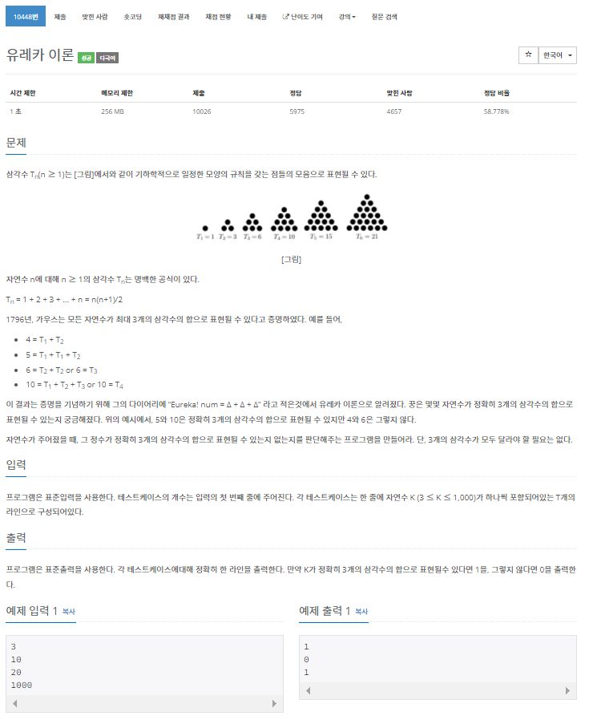

### BOJ 10448 유레카 이론

문제링크 : <https://www.acmicpc.net/problem/10448>



1. 문제 요약

   Tn = n(n+1)/2 로 이루어진 수열이 있다 이 수열의 숫자 세개를 이용해서 입력되는 숫자를 만들수 있다면 1, 만들지 못한다면 0을 출력하라.(숫자는 중복되도 됨)

   

2. 문제 해설

   만들어야 하는 숫자의 범위가 3<=K<=1,000이다. 수열의 숫자 세개로 K를 만들기 위해선 K보단 작아야 할것이다. (44x45)/2=990이고, (45x46)/2=1035이므로 1000까지 만드는데 확인해야할 수열크기가 44밖에 안된다. 미리 배열에 수열을 계산해서 넣어두고 3중포문으로 세개의 숫자의 경우를 전부 더해보고 비교해보면 된다.

   

3. 코드

   ```c++
   #include<iostream>
   using namespace std;
   int arr[45], n, k,chk=-1;
   int main() {
   	for (int i = 1; i <= 44; i++) {
   		arr[i] = i * (i + 1) / 2;
   	}
   	cin >> n;
   	while(n--){
   		cin >> k;
   		for (int i = 1; i <= 44; i++) {
   			for (int j = 1; j <= 44; j++) {
   				for (int p = 1; p <= 44; p++) {
   					if (arr[i] + arr[j] + arr[p] == k) {
   						cout << 1<<"\n";
   						chk = 1;
   						break;
   					}
   				}
   				if (chk == 1)break;
   			}
   			if (chk == 1)break;
   		}
   		if (chk == -1)cout << "0" << "\n";
   		else chk = -1;
   	}
   }
   ```

   